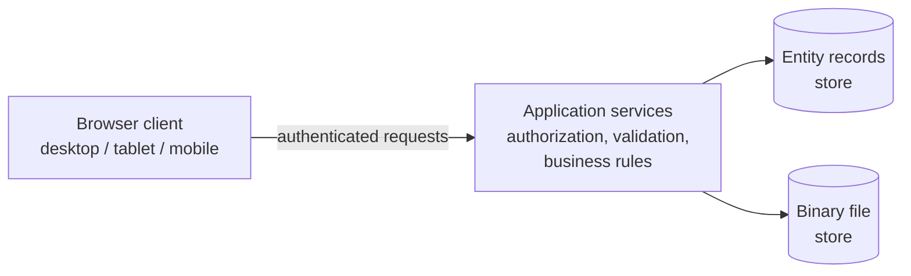
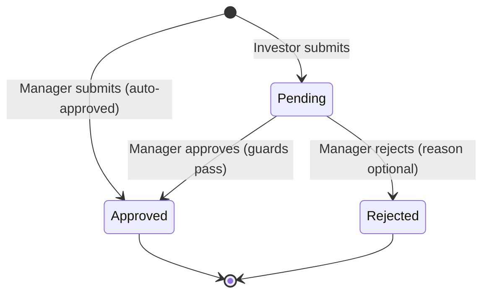
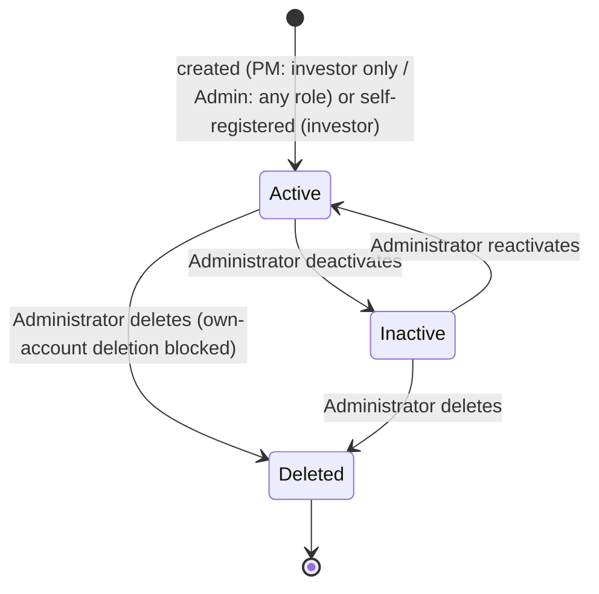
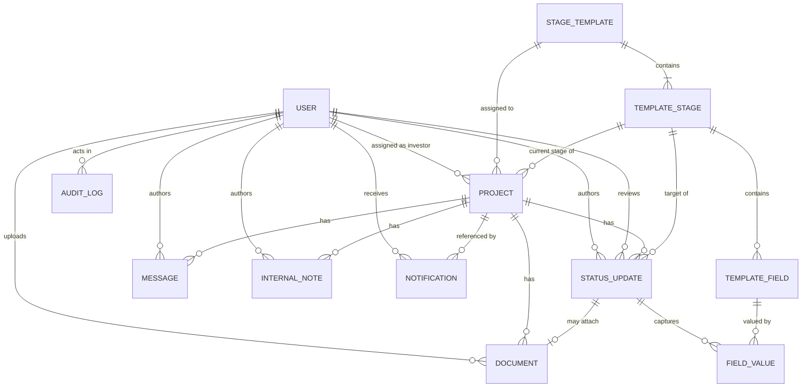

<!-- @format -->

# Software Requirements Specification (SRS)
# JABEEN Investor Portal

---

## 1. Document Control

| Field | Value |
| --- | --- |
| **Document title** | Software Requirements Specification — JABEEN Investor Portal |
| **System name** | JABEEN Investor Portal ("the System") |
| **Prepared by** | Rqeem for Smart Solutions (the digital arm of JABEEN; responsible for IT-related activities) |
| **Prepared for** | Procurement and delivery by a third-party software vendor ("the Vendor") |
| **Operating owner** | JABEEN — Jubail and Yanbu Company for Industrial Cities Services (شركة الجبيل وينبع لخدمات المدن الصناعية), operating in the context of the Royal Commission for Jubail and Yanbu (RCJY) |
| **Document version** | 1.0 |
| **Date** | 2026-06-18 |
| **Status** | Draft for Vendor Review |
| **Standard followed** | ISO/IEC/IEEE 29148 (IEEE 830 lineage) |
| **Classification** | Confidential — for procurement use |
| **Glossary owner** | Rqeem for Smart Solutions — Business Analysis function |

### 1.1 Change History

| Version | Date | Author | Description |
| --- | --- | --- | --- |
| 0.1 | 2026-06-18 | Rqeem BA | Initial reverse-engineered draft from the reference implementation. |
| 1.0 | 2026-06-18 | Rqeem BA | First complete issue for vendor distribution. |

### 1.2 Distribution List

| Recipient | Organization | Purpose |
| --- | --- | --- |
| Procurement committee | Rqeem / JABEEN | Tender evaluation |
| Prospective vendors | External | Build to specification |
| Business owners | JABEEN | Functional validation |
| IT / Security governance | Rqeem | NCA / PDPL compliance review |

### 1.3 Glossary Ownership

The glossary (Appendix 12.1) is owned and maintained by the Rqeem Business Analysis function. All terminology disputes are resolved against the glossary.

---

## 2. Introduction

### 2.1 Purpose

This document specifies the complete functional and non-functional requirements for the JABEEN Investor Portal. Its purpose is to allow a Vendor that has never seen the existing implementation to rebuild the System with full functional parity, and to serve as the contractual baseline for procurement, acceptance testing, and compliance verification.

The document is written so that every requirement is atomic, uniquely numbered, and testable.

### 2.2 Scope and Objectives

The JABEEN Investor Portal is a multi-role web application for tracking industrial investor projects within Jubail Industrial City, from signed agreement through to operational facility.

**In scope:**

- Authenticated, role-based access for four user classes.
- A portfolio of investor projects, each progressing through a configurable lifecycle of stages.
- Investor-submitted progress updates governed by a project-manager review/approval workflow.
- Configurable stage templates ("pipelines") composed of ordered stages and typed data-capture fields, including image/photo capture.
- Per-project document management and a project-scoped messaging thread.
- Internal (staff-only) notes that are never exposed to investors.
- In-application notifications for relevant events.
- A portfolio dashboard with search, filtering, and tabular export.
- User administration, an append-only audit log, and administrator-managed system settings.
- A server-computed, single-source-of-truth project status derivation.

**Out of scope (current build):** external financial systems, payment processing, document e-signature, and any integration with third-party registries. (See §6.2 and the assumptions log for items expected but not yet implemented.)

**Objectives:**

1. Provide JABEEN and Rqeem business users with an accurate, governed view of every investor project.
2. Guarantee that investor-supplied data is reviewed before it becomes the project's official record.
3. Enforce strict role-based and record-level access control.
4. Operate fully within the Kingdom of Saudi Arabia in compliance with NCA regulations and PDPL.

### 2.3 Definitions, Acronyms, and Abbreviations

| Term | Definition |
| --- | --- |
| **System** | The JABEEN Investor Portal specified by this document. |
| **Actor / User** | An authenticated person interacting with the System. |
| **Investor** | External party associated with one or more projects. |
| **Project Manager (PM)** | JABEEN/Rqeem staff member managing projects day-to-day. |
| **Top Management (TM)** | Executive user with read-only portfolio visibility. |
| **Administrator (Admin)** | User with full system-administration privileges. |
| **Project** | An industrial investment initiative tracked through a lifecycle of stages. |
| **Pipeline / Stage Template** | A reusable, ordered set of stages with typed fields, assignable to projects. |
| **Stage** | One step in a pipeline, carrying a name, ordering, progress baseline, and category. |
| **Field** | A typed data-capture element belonging to a stage. |
| **Status Update** | A submission recording a project's movement to a stage, with captured field values and optional documents. |
| **Derived Status** | The server-computed health label of a project (on-track, delayed, stalled, complete). |
| **Internal Note** | A staff-only annotation on a project, never visible to investors. |
| **Notification** | An in-application alert delivered to a specific recipient. |
| **Audit Log** | An append-only record of privileged system actions. |
| **NCA** | National Cybersecurity Authority (KSA). |
| **ECC** | Essential Cybersecurity Controls (NCA). |
| **CCC** | Cloud Cybersecurity Controls (NCA). |
| **PDPL** | Personal Data Protection Law (KSA). |
| **RCJY** | Royal Commission for Jubail and Yanbu. |
| **RTL** | Right-to-left text direction (Arabic). |
| **IDOR** | Insecure Direct Object Reference (an access-control vulnerability class). |
| **RTO / RPO** | Recovery Time Objective / Recovery Point Objective. |

### 2.4 References

| Ref | Document |
| --- | --- |
| R1 | ISO/IEC/IEEE 29148:2018 — Systems and software engineering — Requirements engineering. |
| R2 | NCA Essential Cybersecurity Controls (ECC). |
| R3 | NCA Cloud Cybersecurity Controls (CCC). |
| R4 | Personal Data Protection Law of the Kingdom of Saudi Arabia (PDPL) and its Implementing Regulations. |
| R5 | WCAG 2.1 Level AA (accessibility baseline). |

### 2.5 Document Overview

Section 3 gives the overall description and context. Section 4 specifies functional requirements by module, with workflows and lifecycle state models. Section 5 defines the conceptual data model. Section 6 specifies user and integration interfaces. Section 7 specifies non-functional requirements. Section 8 covers compliance and data residency. Section 9 contains the role-to-permission matrix. Section 10 lists business rules. Section 11 provides acceptance criteria and the traceability matrix. Section 12 contains the glossary and the open-questions/assumptions log.

---

## 3. Overall Description

### 3.1 Product Perspective and Context

The System is a standalone, web-based portal accessed through standard web browsers on desktop, tablet, and mobile form factors. It is composed of three logical tiers, described here as capabilities rather than technologies:

1. **Presentation capability** — a responsive web client that renders screens, captures input, and enforces presentation-level role gating (non-authoritative).
2. **Application capability** — a server-side application exposing a set of authenticated operations that enforce all authorization, validation, and business rules. This tier is the single authority for access decisions and computed values.
3. **Persistence capability** — durable storage for entity records and for uploaded binary files (file content stored separately from file metadata).

The presentation tier holds no authority: every access decision and computed status is produced and enforced by the application tier.

### 3.2 High-Level Functions Summary

| # | Function area | Summary |
| --- | --- | --- |
| F1 | Authentication & session | Self-registration (investor), sign-in, session renewal, sign-out, self-profile management. |
| F2 | Authorization | Four roles; role-based and record-level access control. |
| F3 | Projects | Maintain a portfolio of projects with metadata, assignment, lifecycle position, and derived status. |
| F4 | Stage templates | Define configurable pipelines of ordered stages with typed fields. |
| F5 | Status updates & review | Submit progress updates; project-manager approval workflow. |
| F6 | Documents | Upload, list, download, and administer project documents. |
| F7 | Messaging | Project-scoped message thread. |
| F8 | Internal notes | Staff-only project notes. |
| F9 | Notifications | In-application alerts for messages, notes, and update review events. |
| F10 | Dashboard & export | Portfolio overview, search/filter, tabular export. |
| F11 | User administration | Manage user accounts and credentials. |
| F12 | Audit & settings | Append-only audit log and administrator-managed settings. |

### 3.3 User Classes and Characteristics

| User class | Description | Technical proficiency | Frequency of use |
| --- | --- | --- | --- |
| **Investor** | External project owner; views own project(s), submits updates, uploads documents, participates in the project thread. | General business user. | Periodic. |
| **Top Management** | Executive oversight; read-only access to the full portfolio and contact details. | General business user. | Occasional. |
| **Project Manager** | Operational owner; manages projects, reviews/approves investor updates, maintains internal notes, manages pipelines, creates investor accounts. | Power user. | Daily. |
| **Administrator** | System steward; full user administration, audit log, settings, document administration, project deletion. | Administrator. | As required. |

### 3.4 Operating Environment

- **OE-1** The System shall be a web application accessible through current mainstream web browsers without installation of client software.
- **OE-2** The System shall present a responsive interface usable on desktop, tablet, and mobile screen widths.
- **OE-3** The System shall be deployed on cloud infrastructure.
- **OE-4** All hosting, data storage, data processing, and backups shall reside physically inside the Kingdom of Saudi Arabia.
- **OE-5** The deployment shall comply with NCA regulations, including the Essential Cybersecurity Controls (ECC) and the Cloud Cybersecurity Controls (CCC), and with the Personal Data Protection Law (PDPL).
- **OE-6** No personal data, project data, document content, or audit data shall be stored, replicated, cached, or processed outside the Kingdom of Saudi Arabia.
- **OE-7** The specific cloud provider is not mandated by this document; any provider selected shall satisfy OE-3 through OE-6 and the controls in §8.

### 3.5 Design and Implementation Constraints

The following are true constraints (not current technology choices):

- **DC-1** All authorization and business-rule enforcement shall occur in the application tier; the client shall never be the authority for access or computed values.
- **DC-2** Record-level (row-level) access scoping shall be applied within data-retrieval operations so that out-of-scope records are never returned (IDOR-safe by construction).
- **DC-3** The project status label shall be computed by the application tier and shall be the single source of truth; clients shall display it without recomputation.
- **DC-4** File (binary) content shall be stored separately from entity metadata; only metadata and references are stored as entity records.
- **DC-5** The audit log and the status-update history shall be append-only.
- **DC-6** Data residency and NCA/PDPL compliance (OE-3 to OE-7, §8) are mandatory constraints on any implementation.
- **DC-7** Stage definitions and their fields shall be data-driven (configurable at runtime), not fixed in program code.

### 3.6 Assumptions and Dependencies

- **AD-1** Users have valid email addresses used as login identifiers.
- **AD-2** Browser clients permit secure, script-inaccessible session cookies and run over encrypted transport.
- **AD-3** Items expected by procurement but not present in the reference build (full Arabic/RTL bilingual UI, self-service password reset, email/out-of-band notification delivery) are specified herein as required target capabilities and are flagged in the assumptions log (Appendix 12.2) for confirmation.
- **AD-4** Performance, availability, retention, and recovery figures not derivable from the reference build are stated as conservative targets and flagged for confirmation.

---

## 4. Functional Requirements

Requirements are grouped by module. Each is atomic and testable. "The System shall…" is implied by "shall."

### 4.1 Authentication and Session Management (AUTH)

- **FR-AUTH-001** The System shall allow an unauthenticated visitor to self-register a new account by providing full name, email address, password, and company name.
- **FR-AUTH-002** The System shall require the registration password to be at least 8 characters and at most 128 characters.
- **FR-AUTH-003** The System shall require the registration full name to be 2–160 characters and the company name to be 2–200 characters.
- **FR-AUTH-004** The System shall accept optional title (≤160 characters) and phone (≤40 characters) at registration.
- **FR-AUTH-005** The System shall assign every self-registered account the **Investor** role and shall never accept or honor a role value supplied in a registration request.
- **FR-AUTH-006** The System shall store email addresses in a normalized lower-case form and shall treat email as a unique account identifier.
- **FR-AUTH-007** The System shall reject registration with an email that already exists and shall return a conflict result without revealing other account details.
- **FR-AUTH-008** The System shall authenticate a user by email and password and shall establish a session upon success.
- **FR-AUTH-009** The System shall return a single, non-distinguishing error for an unknown email or an incorrect password (no account-enumeration disclosure).
- **FR-AUTH-010** The System shall deny sign-in to a deactivated account and shall return a distinct "account deactivated" message.
- **FR-AUTH-011** The System shall throttle sign-in attempts using a fixed time window keyed on the combination of client origin and submitted email, and shall reject attempts beyond a configurable maximum within the window with a "too many attempts" result. Default: 10 attempts per 60 seconds (configurable).
- **FR-AUTH-012** The System shall, on successful authentication, issue a short-lived access credential carrying the user identity and role, with a configurable lifetime (default 30 minutes).
- **FR-AUTH-013** The System shall issue a longer-lived session-renewal credential stored in a server-set browser cookie that is inaccessible to client-side scripts, marked secure in production, and restricted to same-site use, with a configurable lifetime (default 7 days).
- **FR-AUTH-014** The System shall provide a session-renewal operation that validates the renewal credential, issues a new access credential, and rotates (replaces) the renewal credential on every use.
- **FR-AUTH-015** The System shall reject session renewal when the renewal credential is missing, invalid, expired, or belongs to a deactivated/absent account.
- **FR-AUTH-016** The System shall provide a sign-out operation that invalidates the renewal credential held by the browser.
- **FR-AUTH-017** The System shall allow an authenticated user to retrieve their own profile.
- **FR-AUTH-018** The System shall allow an authenticated user to edit their own name, title, company, and phone.
- **FR-AUTH-019** The System shall prevent a user from changing their own email address, role, or active status through self-service profile editing.
- **FR-AUTH-020** The System shall, on first load of the client, attempt a silent session renewal to restore an existing session, and shall present the unauthenticated state if renewal fails.
- **FR-AUTH-021 (target capability — see assumptions)** The System shall provide a self-service password-reset workflow that verifies the requester's control of the registered email and allows setting a new password.

**Workflow — Sign-in**

- Preconditions: visitor is unauthenticated; account exists and is active.
- Main flow: visitor submits email + password → System validates throttle → verifies credentials → establishes session → returns access credential, sets renewal cookie, returns user profile.
- Alternate/exception: invalid credentials → 401 generic error; deactivated account → 403; throttle exceeded → 429.
- Post-conditions: an authenticated session exists; the user is routed to their role landing area (Investor → personal projects; TM/PM/Admin → portfolio dashboard).

### 4.2 Authorization and Access Control (RBAC)

- **FR-RBAC-001** The System shall support exactly four roles: Investor, Top Management, Project Manager, Administrator.
- **FR-RBAC-002** The System shall resolve the acting user's identity and role only from the authenticated session and shall never derive authorization from values supplied in the request body or URL.
- **FR-RBAC-003** The System shall treat Top Management, Project Manager, and Administrator as "privileged" for read visibility, granting them access to all projects.
- **FR-RBAC-004** The System shall restrict an Investor's read and write access to only the projects to which that Investor is assigned.
- **FR-RBAC-005** The System shall treat Project Manager and Administrator as "managers" authorized to create and modify project data; Top Management shall have read-only access to project data.
- **FR-RBAC-006** The System shall enforce record-level scoping inside data retrieval so that a request for a record outside the actor's permitted scope returns a not-found result and never returns or leaks the record.
- **FR-RBAC-007** The System shall reject any privileged operation attempted by a role lacking the required privilege with an authorization-denied result.
- **FR-RBAC-008** The System shall deny all operations to unauthenticated requests except registration, sign-in, session renewal, and sign-out.

(The complete action-by-role matrix is in §9.)

### 4.3 Project Management (PROJ)

- **FR-PROJ-001** The System shall store and retrieve Project records with: name, sector, plot number (optional), agreement number, assigned pipeline (optional), current stage (optional), construction-completion percentage, free-text notes (optional), an "attention" flag, last-update timestamp, assigned investor (optional), and creation timestamp.
- **FR-PROJ-002** The System shall enforce uniqueness of the agreement number across all projects.
- **FR-PROJ-003** The System shall list projects, returning only those within the actor's permitted scope (Investor: own; privileged roles: all), ordered by agreement number.
- **FR-PROJ-004** The System shall return, for each listed project, its derived status and current-stage summary.
- **FR-PROJ-005** The System shall return a single project's full detail only when the project is within the actor's scope, and shall return not-found otherwise.
- **FR-PROJ-006** The System shall include the project's full ordered pipeline (stages and their field definitions) in the single-project detail response so that the assigned investor and staff can view and complete stage fields.
- **FR-PROJ-007** The System shall include investor contact details in project responses only for privileged roles, and shall omit them for investors viewing their own project.
- **FR-PROJ-008** The System shall allow a manager to create a project with name, sector, agreement number, optional plot number, optional assigned pipeline, optional initial construction percentage, and optional assigned investor.
- **FR-PROJ-009** The System shall, when a pipeline is assigned to a project, set the project's current stage to the first stage of that pipeline.
- **FR-PROJ-010** The System shall allow a manager to update a project's name, sector, plot number, notes, attention flag, construction percentage, assigned investor, and assigned pipeline.
- **FR-PROJ-011** The System shall validate that an investor assigned to a project references an existing account whose role is Investor, and shall reject otherwise.
- **FR-PROJ-012** The System shall, when a project's pipeline is changed, reset the project's current stage to the first stage of the newly assigned pipeline.
- **FR-PROJ-013** The System shall allow only an Administrator to delete a project, and shall cascade deletion to that project's updates, documents, internal notes, messages, captured field values, and notifications.
- **FR-PROJ-014** The System shall prevent the project's official stage from being advanced through metadata editing; stage advancement shall occur only through the approved status-update workflow (§4.5).
- **FR-PROJ-015** The System shall expose the project notes field to the assigned investor (investor-visible notes), distinct from internal notes (§4.8).

### 4.4 Stage Templates / Pipelines (TPL)

- **FR-TPL-001** The System shall store and retrieve Stage Template records, each with a name, optional description, a default-flag, and an ordered set of stages.
- **FR-TPL-002** The System shall store, for each stage, a name, optional description, an explicit order index, a progress-completion baseline percentage (0–100), and a category of exactly one of: on-hold, active, complete.
- **FR-TPL-003** The System shall store, for each field, a name, a base storage type, a display widget, a required flag, an ordered position, an optional list of choice options, and an optional configuration object.
- **FR-TPL-004** The System shall support these field base storage types: text, number, date, boolean, file, image, single-choice, multi-choice.
- **FR-TPL-005** The System shall support these display widgets and shall permit each only with its compatible base type:

  | Base type | Permitted widgets |
  | --- | --- |
  | text | single-line text, multi-line text, email, telephone |
  | number | number |
  | date | date |
  | boolean | checkbox, toggle |
  | file | file upload |
  | image | single photo, photo gallery |
  | single-choice | drop list, list box, radio |
  | multi-choice | checkbox list, list box |

- **FR-TPL-006** The System shall reject a field definition whose widget is not permitted for its base type.
- **FR-TPL-007** The System shall require at least one option for any single-choice or multi-choice field and shall reject choice fields with no options.
- **FR-TPL-008** The System shall require option values within a single choice field to be unique and shall reject duplicates.
- **FR-TPL-009** The System shall allow only managers (Project Manager, Administrator) to create, read, edit, and delete stage templates.
- **FR-TPL-010** The System shall validate all field definitions before persisting any change to a template (validate-before-write), so that an invalid template is never partially saved.
- **FR-TPL-011** The System shall apply template edits with replace-on-save semantics: the submitted set of stages and fields fully replaces the template's prior stages and fields, with order indices assigned by submitted position.
- **FR-TPL-012** The System shall enforce that at most one template is marked default; marking a template default shall clear the default flag on all others.
- **FR-TPL-013** The System shall provide a lightweight template listing (name, description, default flag, stage count) distinct from full template detail.
- **FR-TPL-014** The System shall expose the default template's stages as reference lookup data to administrators.
- **FR-TPL-015** The System shall allow a template to be deleted by a manager.

### 4.5 Status Updates and Review Workflow (UPD)

- **FR-UPD-001** The System shall record Status Update records, each with: project, author, source stage (optional), target stage, construction percentage, optional note, optional attached document, review status, reviewer (optional), review timestamp (optional), review note (optional), captured field values, and creation timestamp.
- **FR-UPD-002** The System shall accept a status update only for a target stage that belongs to the assigned pipeline of the update's project, and shall reject any other target stage.
- **FR-UPD-003** The System shall reject a status update for a project that has no assigned pipeline.
- **FR-UPD-004** The System shall default the construction percentage of an update to the target stage's baseline percentage when no explicit value is provided, and shall require any provided value to be within 0–100.
- **FR-UPD-005** The System shall classify a status update submitted by an Investor as **pending** and shall not alter the project's official state until the update is approved.
- **FR-UPD-006** The System shall permit an Investor to have at most one pending update per project at any time, rejecting a further submission while a pending update exists.
- **FR-UPD-007** The System shall enforce the single-pending-update rule atomically so that concurrent submissions cannot create two pending updates for the same project.
- **FR-UPD-008** The System shall classify a status update submitted by a manager (Project Manager, Administrator) as **approved**, record the submitter as reviewer, and apply it to the project immediately.
- **FR-UPD-009** The System shall, upon approval of an update, set the project's current stage to the update's target stage, set the project's construction percentage to the update's value, and set the project's last-update timestamp to the approval time.
- **FR-UPD-010** The System shall, upon approval, record the update's source stage as the project's current stage at the moment of approval, so the recorded transition reflects reality even if other updates intervened.
- **FR-UPD-011** The System shall allow only managers to approve or reject pending updates.
- **FR-UPD-012** The System shall reject approval of an update whose target stage no longer belongs to the project's current pipeline (e.g., after a pipeline reassignment) and shall instruct that the update be rejected and resubmitted.
- **FR-UPD-013** The System shall reject approval of an update whose target stage precedes the project's current stage in pipeline order (no silent backward movement), and shall instruct that a fresh update be submitted.
- **FR-UPD-014** The System shall, upon rejection, set the update's status to rejected, record the reviewer, review timestamp, and an optional review note, and shall leave the project's official state unchanged.
- **FR-UPD-015** The System shall allow an Investor to submit a new update once a prior update has been approved or rejected.
- **FR-UPD-016** The System shall reject a second review action on an update that has already been approved or rejected.
- **FR-UPD-017** The System shall exclude pending updates from the project's official state, derived status, and current-stage document check; only approved updates affect the project.
- **FR-UPD-018** The System shall list a project's updates in reverse chronological order, including pending, approved, and rejected updates, restricted to actors within the project's scope.
- **FR-UPD-019** The System shall preserve all status-update records as an append-only history that survives subsequent project edits.
- **FR-UPD-020** The System shall capture the target stage's field values with the update (see §4.6) and persist them with the update record.

**Status Update lifecycle**

**Approval guard table**

| Condition at approval time | Result |
| --- | --- |
| Target stage not in project's current pipeline | Rejected with 409 — instruct resubmission |
| Target stage order < current stage order | Rejected with 409 — no backward move |
| Update already approved/rejected | Rejected with 409 — already reviewed |
| All guards pass | Approved; project advances to target stage |

**Workflow — Investor update with PM review**

- Preconditions: Investor owns the project; project has an assigned pipeline; no pending update exists for the project.
- Main flow: Investor selects a target stage, completes required stage fields, optionally attaches documents → System validates field values and required fields → creates a pending update → notifies managers (see §4.9).
- Alternate/exception: a pending update already exists → 409; required field missing → 422; invalid target stage → 422; unsupported file type → 415; file too large → 413.
- Post-conditions: a pending update exists; the project's official state is unchanged; managers are alerted.
- Review: a manager approves (project advances; investor notified) or rejects (reason recorded; investor notified; project unchanged).

### 4.6 Field-Value Capture (FLD)

- **FR-FLD-001** The System shall, when a status update is submitted, capture a value for each field defined on the target stage.
- **FR-FLD-002** The System shall reject a submission in which a field marked required has no value (empty text, empty selection, or no file).
- **FR-FLD-003** The System shall store non-binary field values (text, number, date, boolean, single-choice, multi-choice) as the captured value associated with the update and field.
- **FR-FLD-004** The System shall store binary field values (file, image) as one or more stored documents and shall associate their references with the update and field.
- **FR-FLD-005** The System shall accept multiple files for a photo-gallery (image) field and shall accept a single file for a single-photo or single-file field.
- **FR-FLD-006** The System shall restrict image fields to image content and shall reject non-image uploads to image fields.
- **FR-FLD-007** The System shall validate all captured values before persisting the update, so that an invalid submission persists nothing.
- **FR-FLD-008** The System shall present captured field values back to authorized viewers, rendering image values as viewable thumbnails and file values as downloadable references.
- **FR-FLD-009** The System shall ignore submitted field values whose field does not belong to the update's target stage.
- **FR-FLD-010 (target capability — see assumptions)** The System shall validate, at submission, that single-choice and multi-choice values are members of the field's defined option set and that values conform to the field's base type.

### 4.7 Documents (DOC)

- **FR-DOC-001** The System shall accept an optional supporting document attached to a status update.
- **FR-DOC-002** The System shall store document metadata (file name, content type, size, uploader, project, creation time) separately from the file's binary content.
- **FR-DOC-003** The System shall reject any uploaded file exceeding the maximum size limit (default 20 MB).
- **FR-DOC-004** The System shall accept only an allow-listed set of document content types and shall reject all others. The allow-list includes: portable document format, common image formats (PNG, JPEG, WebP), common word-processing and spreadsheet document formats, plain text, and comma-separated values.
- **FR-DOC-005** The System shall list a project's documents in reverse chronological order, restricted to actors within the project's scope.
- **FR-DOC-006** The System shall allow a document to be downloaded only by an actor authorized to access its parent project, and shall return not-found otherwise.
- **FR-DOC-007** The System shall store each uploaded file under a non-guessable generated storage key, never under user-supplied path input.
- **FR-DOC-008** The System shall allow an Administrator to list all documents across all projects.
- **FR-DOC-009** The System shall allow an Administrator to delete a document, detach it from any referencing update, and remove its stored binary content.
- **FR-DOC-010** The System shall count a document toward a project's "current-stage document present" check only when it belongs to an **approved** update whose target stage equals the project's current stage.

### 4.8 Project Messaging (MSG)

- **FR-MSG-001** The System shall maintain a message thread scoped to a single project.
- **FR-MSG-002** The System shall return a project's messages in chronological order only to actors within the project's scope.
- **FR-MSG-003** The System shall record, for each message, the project, author, author role, body, and creation time.
- **FR-MSG-004** The System shall allow the assigned Investor, Project Managers, and Administrators to post messages to a project thread.
- **FR-MSG-005** The System shall deny Top Management the ability to post messages (read-only thread access).
- **FR-MSG-006** The System shall reject an empty message body and shall accept a body of 1–4000 characters.

### 4.9 Internal Notes (NOTE)

- **FR-NOTE-001** The System shall maintain internal notes attached to a project, recording author, body, and creation time.
- **FR-NOTE-002** The System shall allow only managers (Project Manager, Administrator) to create and read internal notes.
- **FR-NOTE-003** The System shall never expose internal notes, nor any notification derived from them, to Investors or Top Management.
- **FR-NOTE-004** The System shall return internal notes for a project in reverse chronological order.
- **FR-NOTE-005** The System shall accept an internal-note body of 1–4000 characters.

### 4.10 Notifications (NOTIF)

- **FR-NOTIF-001** The System shall create per-recipient in-application notifications for defined events and shall store each with recipient, kind, optional related project, optional actor, title, optional body, read state, and creation time.
- **FR-NOTIF-002** The System shall, when a project message is posted, notify the project's assigned investor and all managers, excluding the message author.
- **FR-NOTIF-003** The System shall, when an internal note is added, notify only other managers (never investors or Top Management), excluding the note author.
- **FR-NOTIF-004** The System shall, when an Investor submits an update, notify all managers that a review is required.
- **FR-NOTIF-005** The System shall, when a manager approves or rejects an update, notify the project's assigned investor of the outcome, including the rejection reason when present.
- **FR-NOTIF-006** The System shall never notify the actor who triggered an event about their own action, and shall de-duplicate recipients.
- **FR-NOTIF-007** The System shall return a recipient's notifications, newest first, scoped strictly to that recipient.
- **FR-NOTIF-008** The System shall provide an unread-count operation scoped to the requesting recipient.
- **FR-NOTIF-009** The System shall allow a recipient to mark a single notification read and to mark all of their notifications read.
- **FR-NOTIF-010** The System shall reject any attempt to read or modify a notification that does not belong to the requesting recipient (not-found result).
- **FR-NOTIF-011** The System shall surface unread notifications in the client through an always-available indicator showing the unread count, with a panel listing notifications and a deep link to the related project context for each.
- **FR-NOTIF-012** The System shall commit a notification within the same logical transaction as the action that produced it, so the action and its notifications either both persist or both fail.
- **FR-NOTIF-013 (target capability — see assumptions)** The System shall deliver notifications through an additional out-of-band channel (e.g., email) governed by an administrator-controlled toggle.

### 4.11 Dashboard, Search, and Export (DASH)

- **FR-DASH-001** The System shall present privileged roles a portfolio dashboard summarizing all projects.
- **FR-DASH-002** The System shall display portfolio key figures: total project count, count of completed projects (current stage category = complete), count of in-progress projects (current stage category = active), and count needing attention (attention flag set or derived status = stalled).
- **FR-DASH-003** The System shall allow free-text search across project name, agreement number, sector, and assigned investor name/company.
- **FR-DASH-004** The System shall allow filtering the portfolio by derived status, by current stage name, and by sector.
- **FR-DASH-005** The System shall present each project row with agreement number, name, sector, investor, current stage, construction progress, derived status, and last-update recency.
- **FR-DASH-006** The System shall allow managers to export the full portfolio as a downloadable tabular file containing, per project: agreement number, name, sector, plot number, pipeline name, current stage name, construction percentage, derived status, investor company, investor email, last-update timestamp, and attention flag.
- **FR-DASH-007** The System shall present Investors a personal landing area listing only their assigned project(s) with status, stage, and progress.

### 4.12 Derived Project Status (STAT)

- **FR-STAT-001** The System shall compute each project's status on the server as exactly one of: on-track, delayed, stalled, complete.
- **FR-STAT-002** The System shall evaluate status by first-match-wins in this order: complete → stalled → delayed → on-track.
- **FR-STAT-003** The System shall classify a project as **complete** when its current stage's category is "complete."
- **FR-STAT-004** The System shall classify a project as **stalled** when its current stage's category is "on-hold," when it has no assigned stage, or when the time since its last approved update exceeds the stalled threshold (default 45 days).
- **FR-STAT-005** The System shall classify a project as **delayed** when the time since its last approved update exceeds the delayed threshold (default 30 days) or when there is no approved current-stage document on file.
- **FR-STAT-006** The System shall classify a project as **on-track** when none of the complete, stalled, or delayed conditions apply.
- **FR-STAT-007** The System shall treat a naive (timezone-less) last-update timestamp as coordinated universal time when computing elapsed days.
- **FR-STAT-008** The client shall display the server-computed status without recomputing it.

**Derived status decision table**

| Order | Condition | Resulting status |
| --- | --- | --- |
| 1 | current stage category = complete | complete |
| 2 | current stage category = on-hold, OR no stage assigned, OR days-since-last-approved-update > 45 | stalled |
| 3 | days-since-last-approved-update > 30, OR no approved current-stage document | delayed |
| 4 | otherwise | on-track |

### 4.13 User Administration (USER)

- **FR-USER-001** The System shall allow managers (Project Manager, Administrator) to list user accounts, optionally filtered by role, ordered by role then name.
- **FR-USER-002** The System shall allow a Project Manager to create accounts with the Investor role only.
- **FR-USER-003** The System shall allow an Administrator to create accounts with any role.
- **FR-USER-004** The System shall, on account creation, generate a one-time provisioning password when no password is supplied, and shall surface that password exactly once in the creation response.
- **FR-USER-005** The System shall reject account creation with an email that already exists (conflict result).
- **FR-USER-006** The System shall allow only an Administrator to edit, update, deactivate, reset the password of, or delete an existing user account.
- **FR-USER-007** The System shall deny Project Managers any modification of existing accounts (edit, password reset, deactivation, deletion), permitting them only account creation (FR-USER-002) and listing (FR-USER-001).
- **FR-USER-008** The System shall prevent any user from deactivating their own account.
- **FR-USER-009** The System shall prevent any user from deleting their own account.
- **FR-USER-010** The System shall, on user deletion, detach (unassign) that user from any projects they owned rather than deleting those projects.
- **FR-USER-011** The System shall, on user deletion, remove notifications addressed to that user and clear actor references to that user on remaining notifications.
- **FR-USER-012** The System shall allow an Administrator to reset a user's password, generating a new one-time password surfaced once.
- **FR-USER-013** The System shall hide account-modification controls (edit, reset, delete) from non-administrators in the client, while enforcing the restriction authoritatively at the application tier (the hidden controls are not the access gate).

**User account lifecycle**

### 4.14 Audit Log (AUDIT)

- **FR-AUDIT-001** The System shall record an append-only audit entry for each privileged system action, capturing actor, action name, target type, target identifier, optional structured detail, and timestamp.
- **FR-AUDIT-002** The System shall record audit entries for at least: user created, user updated, user credentials provisioned, user deleted, project created, project assigned (investor), project pipeline assigned, project attention-flag changed, project deleted, status update approved, status update rejected, stage template created, stage template updated, stage template deleted, settings updated, and document deleted.
- **FR-AUDIT-003** The System shall allow only Administrators to read the audit log.
- **FR-AUDIT-004** The System shall return audit entries newest first, optionally filtered by action, with a bounded page size (default 100, maximum 500).
- **FR-AUDIT-005** The System shall never allow modification or deletion of an audit entry through any operation.

### 4.15 System Settings (SET)

- **FR-SET-001** The System shall store administrator-managed settings as named key/value entries with last-updated timestamp and updating actor.
- **FR-SET-002** The System shall allow only Administrators to read and write settings.
- **FR-SET-003** The System shall provide a notifications setting containing an out-of-band-notification enabled flag and a stalled-alert threshold in days.
- **FR-SET-004** The System shall provide reference lookups (default pipeline stages, status values, role values) to Administrators.

> Note (flagged inconsistency — see assumptions log): in the reference build the stalled-alert threshold setting is stored but the derived-status engine uses fixed default thresholds (45/30 days). The target requirement is that the configured threshold drives the engine (see Open Questions OQ-7).

### 4.16 System Health (SYS)

- **FR-SYS-001** The System shall expose an unauthenticated health-status endpoint reporting service identity and version for monitoring purposes, disclosing no sensitive data.

---

## 5. Data Requirements

### 5.1 Conceptual Data Model

### 5.2 Entities and Attributes (business meaning)

**User**

| Attribute | Business meaning |
| --- | --- |
| Identifier | Unique account reference. |
| Role | One of Investor, Top Management, Project Manager, Administrator. |
| Name | Full display name (2–160 chars). |
| Email | Unique login identifier, stored lower-case. |
| Password (secret) | Verifier for authentication (never returned by the System). |
| Title | Optional job title. |
| Company | Optional organization name. |
| Phone | Optional contact number. |
| Active flag | Whether the account may sign in. |
| Created at | Account creation time. |

**Project**

| Attribute | Business meaning |
| --- | --- |
| Identifier | Unique project reference. |
| Name | Project title. |
| Sector | Industrial sector. |
| Plot number | Optional plot reference. |
| Agreement number | Unique signed-agreement reference. |
| Assigned pipeline | The stage template the project follows (optional). |
| Current stage | The project's present stage within its pipeline (optional). |
| Construction percentage | Live completion measure (0–100). |
| Notes | Investor-visible free text (optional). |
| Attention flag | Marks the project as needing attention. |
| Last update | Timestamp of last approved progress. |
| Assigned investor | The owning investor account (optional). |
| Created at | Project creation time. |

**Stage Template (Pipeline)**: name; optional description; default flag; created-by; timestamps; ordered stages.

**Template Stage**: parent template; name; optional description; order index; progress baseline percentage (0–100); category (on-hold / active / complete); ordered fields.

**Template Field**: parent stage; name; base storage type (text / number / date / boolean / file / image / single-choice / multi-choice); display widget; required flag; order index; optional choice options (label + value pairs); optional configuration.

**Status Update**: project; author; source stage (optional); target stage; construction percentage; optional note; optional attached document; review status (pending / approved / rejected); reviewer (optional); review timestamp (optional); review note (optional); captured field values; created at.

**Field Value**: parent status update; field; captured value (scalar, list, or document references depending on base type).

**Document**: parent project; uploader; file name; content type; size; storage reference; created at.

**Internal Note**: project; author; body; created at.

**Message**: project; author; author role; body; created at.

**Notification**: recipient; kind (message / internal-note / update-submitted / update-approved / update-rejected); optional related project; optional actor; title; optional body; read flag; read timestamp (optional); created at.

**Audit Log**: actor (optional); action; target type; target identifier; optional structured detail; created at (indexed).

**System Setting**: key; value; updated at; updating actor.

### 5.3 Cardinality Summary

| Relationship | Cardinality |
| --- | --- |
| User (investor) → Project | 1 : 0..* |
| Stage Template → Template Stage | 1 : 1..* |
| Template Stage → Template Field | 1 : 0..* |
| Stage Template → Project (assigned) | 1 : 0..* |
| Project → Status Update | 1 : 0..* |
| Status Update → Field Value | 1 : 0..* |
| Template Field → Field Value | 1 : 0..* |
| Status Update → Document (attachment) | 1 : 0..1 |
| Project → Document / Internal Note / Message | 1 : 0..* |
| User → Notification (recipient) | 1 : 0..* |

### 5.4 Data Retention, Archival, and Residency

- **DR-001** The System shall retain status-update history and audit-log entries as permanent, append-only records for the operational life of the System.
- **DR-002** The System shall retain project, user, document-metadata, message, and notification records until explicitly deleted through an authorized operation.
- **DR-003** The System shall remove a document's binary content from storage when the document is deleted by an Administrator.
- **DR-004** All entity records, binary file content, audit data, and backups shall reside exclusively within the Kingdom of Saudi Arabia (see §8).
- **DR-005 (target — see assumptions)** The System shall apply a defined retention and archival schedule for personal data consistent with PDPL data-minimization and storage-limitation principles. Specific retention periods require confirmation (OQ-5).

### 5.5 Reference Data and Lookups

- **RD-001** Role values: Investor, Top Management, Project Manager, Administrator.
- **RD-002** Derived status values: on-track, delayed, stalled, complete.
- **RD-003** Stage categories: on-hold, active, complete.
- **RD-004** Field base types and permitted widgets (per FR-TPL-005).
- **RD-005** Notification kinds: message, internal-note, update-submitted, update-approved, update-rejected.
- **RD-006** The reference build seeds a default "RCJY Standard" pipeline of seven stages — On Hold (on-hold, 0%), Agreement Signed (active, 10%), Drawings Submitted (active, 25%), Permits Obtained (active, 40%), Construction Underway (active, 65%), Testing & Commissioning (active, 85%), Operational (complete, 100%) — as initial configurable reference data, not as fixed program behavior.
- **RD-007** Allow-listed document content types per FR-DOC-004.

---

## 6. External Interface Requirements

### 6.1 User Interface Requirements

General:

- **UI-001** The System shall present a responsive web interface adapting to desktop, tablet, and mobile widths.
- **UI-002** The System shall route each authenticated user to a role-appropriate landing area (Investor → personal projects; Top Management, Project Manager, Administrator → portfolio dashboard).
- **UI-003** The System shall present an always-available notification indicator with unread count and a panel of recent notifications that deep-link to the related project context.
- **UI-004** The System shall display the server-computed derived status using a clear visual status indicator and shall not recompute status on the client.
- **UI-005** The System shall provide clear validation feedback at field and form level, with accessible error roles and focus states.
- **UI-006** The System shall provide loading, empty, and error states for every data view.
- **UI-007 (target capability — see assumptions)** The System shall provide a fully bilingual interface in Arabic and English, including complete right-to-left (RTL) layout mirroring when Arabic is active. (The reference build presents an English interface with Arabic brand/owner text on the sign-in screen only; full bilingual/RTL is a required target — OQ-1.)
- **UI-008** The System shall meet the accessibility baseline in §7.7.

Screen inventory (described as capabilities):

| Screen | Capability | Key fields / interactions |
| --- | --- | --- |
| **Sign-in / Register** | Authenticate or self-register | Email, password (sign-in); name, email, company, password (register, password ≥ 8). Forgot-password entry point (target — OQ-2). |
| **Investor — My Projects** | List the investor's own projects | Project name, agreement number, sector, current stage, construction progress, derived status, last-update recency; open project. |
| **Portfolio Dashboard** | Portfolio overview for privileged roles | Key figures (total / complete / in-progress / attention); search; filters (status, stage, sector); project table; export (managers). |
| **Project Workspace — Overview** | View project header and lifecycle | Pipeline name, current stage, plot number, last update; visual stage timeline; construction progress; investor contact card (privileged only); investor-visible notes. |
| **Project Workspace — Updates** | Submit and review updates | Target-stage selector (from project pipeline), construction-progress control, note, dynamic stage-field form (typed widgets incl. photo capture with preview), supporting document; update history with review status badges; approve/reject controls (managers); reject-reason capture. |
| **Project Workspace — Documents** | List and download project documents | File name, size, date, download. |
| **Project Workspace — Messages** | Project thread | Chronological messages with author and role; compose (read-only for Top Management). |
| **Project Workspace — Internal Notes** | Staff-only notes | List and add notes (managers only; never visible to investors). |
| **Project Workspace — Manage** | Manage project metadata | Name, sector, plot number, pipeline (reassign resets stage), construction %, assigned investor, attention flag, investor-visible notes; delete (Administrator only). |
| **Stage Templates** | Manage pipelines | List templates; builder for stages (name, category, progress %, description) and fields (label, base type, widget, required, options) with reorder and live field preview. |
| **Users** | Manage accounts | List/search/filter; create account (PM: investor only; Admin: any role) with one-time password display; edit / reset password / delete (Administrator only). |
| **Audit Log** | Review system actions | Time, action, target, actor, detail (Administrator only). |
| **Settings** | System settings | Notifications (out-of-band toggle, stalled threshold); link to stage-template management (Administrator only). |
| **Profile** | Self-service profile | Edit name, title, company, phone (email/role/active not editable). |

### 6.2 System and Integration Interfaces

The reference build contains no external system integrations. Interfaces are limited to the following internal/business interfaces, described by business function:

| Interface | Business function | Data exchanged | Direction | Frequency / trigger |
| --- | --- | --- | --- | --- |
| **IF-001 Authentication session** | Establish and renew authenticated sessions | Credentials in; access credential out; renewal credential set in browser | Client ⇄ Application | On sign-in, on silent renewal, and before access-credential expiry |
| **IF-002 File retrieval** | Deliver a stored document to an authorized requester | Document reference in; file content out | Application → Client | On user download request |
| **IF-003 Portfolio export** | Provide a tabular portfolio extract | None in; tabular dataset out | Application → Client | On manager export request |
| **IF-004 Monitoring health** | Report service liveness | None in; status out | Application → Monitor | On monitoring poll |
| **IF-005 (target) Out-of-band notification** | Deliver alerts via an external channel (e.g., email) | Event summary out | Application → External channel | On notifiable event, subject to setting (OQ-3) |

- **IF-006** Any future integration shall be specified by its business function, data exchanged, direction, frequency, and trigger, and shall comply with the data-residency and security requirements of §7 and §8.

---

## 7. Non-Functional Requirements

### 7.1 Performance and Capacity

- **NFR-PERF-001 (target)** The System shall return any interactive read operation within 2 seconds at the 95th percentile under expected load.
- **NFR-PERF-002 (target)** The System shall complete any write/approval operation within 3 seconds at the 95th percentile, excluding file upload transfer time.
- **NFR-PERF-003 (target)** The System shall support at least 200 concurrent active users and a portfolio of at least 5,000 projects without breaching NFR-PERF-001/002.
- **NFR-PERF-004** The System shall enforce a maximum single-file upload size (default 20 MB) and shall reject larger files deterministically.
- **NFR-PERF-005** The System shall return list views using server-side pagination or bounded result sizes for large collections (the audit log is bounded to a maximum page of 500; other large lists shall be bounded similarly — OQ-6).

(Performance figures not derivable from the reference build are conservative targets pending confirmation.)

### 7.2 Availability and Reliability

- **NFR-AVL-001 (target)** The System shall provide a monthly availability of at least 99.5% during business operating hours.
- **NFR-AVL-002** The System shall expose a health-status endpoint enabling automated liveness monitoring (FR-SYS-001).
- **NFR-AVL-003** The System shall ensure that an action and its dependent side effects (e.g., a status update and its captured values and notifications) are committed atomically; partial persistence shall not occur.
- **NFR-AVL-004 (target)** The System shall define an RTO and RPO for service restoration (see §7.10; values require confirmation — OQ-4).

### 7.3 Scalability

- **NFR-SCAL-001** The System shall be deployable in a horizontally scalable configuration of stateless application instances behind a load distributor.
- **NFR-SCAL-002** The System shall not rely on in-process state for correctness of security controls; any throttling/session state shall be implemented in a shared store when run in multiple instances. (The reference build's in-process login throttle is single-instance only and shall be replaced by a shared mechanism for multi-instance deployment — OQ-8.)

### 7.4 Security — Authentication

- **NFR-SEC-001** The System shall store passwords only as salted, computationally hard, one-way hashes using a strong adaptive hashing scheme; plaintext passwords shall never be stored or logged.
- **NFR-SEC-002** The System shall never return password material or password hashes in any response.
- **NFR-SEC-003** The System shall issue signed, time-limited access credentials and shall reject expired or tampered credentials.
- **NFR-SEC-004** The System shall rotate the session-renewal credential on every renewal.
- **NFR-SEC-005** The System shall throttle authentication attempts to mitigate brute-force attacks (FR-AUTH-011).
- **NFR-SEC-006** The System shall generate one-time provisioning passwords using a cryptographically secure random source and an unambiguous character set.

### 7.5 Security — Authorization and Record-Level Access

- **NFR-SEC-007** The System shall enforce role-based authorization on every privileged operation at the application tier.
- **NFR-SEC-008** The System shall enforce record-level scoping within data retrieval so out-of-scope records are never returned (IDOR-safe), returning not-found rather than forbidden where disclosure of existence would itself leak information.
- **NFR-SEC-009** The System shall derive the acting identity and role solely from the authenticated session, never from client-supplied role or identity values.
- **NFR-SEC-010** The System shall guarantee that internal notes and their derived notifications are never disclosed to Investors or Top Management.

### 7.6 Security — Session, Transport, Encryption, Secrets, Input

- **NFR-SEC-011** The System shall transmit all traffic over encrypted transport.
- **NFR-SEC-012** The System shall store the session-renewal credential in a browser cookie that is inaccessible to client-side scripts, marked secure, and restricted to same-site use.
- **NFR-SEC-013** The System shall encrypt all data at rest, including entity records, file content, and backups.
- **NFR-SEC-014** The System shall hold all secrets (signing keys, credentials, configuration secrets) outside source code and source control, injected via the runtime environment, and shall use a strong, unique signing secret in production.
- **NFR-SEC-015** The System shall validate and constrain all input (types, lengths, ranges, allowed values, content types, file sizes) at the application tier before processing.
- **NFR-SEC-016** The System shall store uploaded files under non-guessable generated keys and shall never use user-supplied input as a file-system path.
- **NFR-SEC-017** The System shall protect against common web vulnerabilities, including injection, broken access control, cross-site scripting, cross-site request forgery, insecure direct object references, and security misconfiguration, consistent with prevailing secure-development practice.
- **NFR-SEC-018** The System shall restrict cross-origin access to an explicitly configured allow-list of trusted origins.

### 7.7 Usability and Accessibility

- **NFR-USE-001** The System shall meet WCAG 2.1 Level AA, including keyboard operability, visible focus states, sufficient contrast, and programmatic labels/roles for interactive elements and validation messages.
- **NFR-USE-002** The System shall present consistent navigation and clear status, empty, loading, and error states across all screens.
- **NFR-USE-003** The System shall respect a user's reduced-motion preference for non-essential animation.

### 7.8 Localization and Internationalization

- **NFR-LOC-001 (target — see assumptions)** The System shall support Arabic and English throughout, with full RTL layout mirroring when Arabic is selected, including dates, numbers, and form layouts. (Reference build: English UI with limited Arabic brand text — OQ-1.)
- **NFR-LOC-002** The System shall store and display Unicode text correctly, including Arabic content, in all free-text fields.
- **NFR-LOC-003** The System shall present timestamps consistently and unambiguously and shall treat stored times as coordinated universal time for computation.

### 7.9 Maintainability and Supportability

- **NFR-MNT-001** The System shall be organized into clearly separated capability modules (authentication, authorization, projects, templates, updates, documents, messaging, notes, notifications, users, audit, settings) with well-defined interfaces.
- **NFR-MNT-002** The System shall keep stage and field definitions data-driven and runtime-configurable (no code change to add or alter stages/fields).
- **NFR-MNT-003** The System shall provide a repeatable means to initialize required reference data on a fresh environment in an idempotent manner.
- **NFR-MNT-004** The System shall emit operational logs sufficient for troubleshooting without recording secrets or plaintext passwords.
- **NFR-MNT-005** The System shall be accompanied by an automated test suite validating access control, the review workflow, status derivation, and field validation.

### 7.10 Backup, Recovery, and Business Continuity

- **NFR-BCP-001** The System shall perform regular automated backups of all entity records and file content, stored within the Kingdom of Saudi Arabia.
- **NFR-BCP-002** The System shall support restoration from backup to a defined recovery point.
- **NFR-BCP-003 (target)** The System shall meet an RPO of at most 24 hours and an RTO of at most 4 hours (values require confirmation — OQ-4).
- **NFR-BCP-004** The System shall periodically verify backup integrity and restorability.

---

## 8. Compliance and Data Residency

### 8.1 Mandatory In-Kingdom Hosting and Data Residency

- **CMP-001** The solution shall be hosted on cloud infrastructure located inside the Kingdom of Saudi Arabia.
- **CMP-002** All data — personal data, project data, documents, audit records, logs, and backups — shall be stored, processed, and retained exclusively within the Kingdom of Saudi Arabia.
- **CMP-003** No data shall be transferred, replicated, cached, or processed outside the Kingdom of Saudi Arabia without prior, documented, lawful authorization.

### 8.2 NCA ECC and CCC Alignment

- **CMP-004** The solution shall align with the NCA Essential Cybersecurity Controls (ECC), including governance, identity and access management, data protection, cryptography, logging and monitoring, vulnerability management, and incident handling.
- **CMP-005** The solution shall align with the NCA Cloud Cybersecurity Controls (CCC) applicable to the cloud hosting model, including tenant isolation, data-location assurance, key management, and shared-responsibility delineation between the cloud service provider and the operator.
- **CMP-006** The solution shall maintain audit trails (FR-AUDIT-*) sufficient to evidence privileged actions for security review.
- **CMP-007** The solution shall enforce least-privilege access consistent with the role model (§9) and record-level scoping (NFR-SEC-008).

### 8.3 PDPL Alignment

- **CMP-008** The solution shall process personal data (names, emails, phone numbers, company affiliations, project participation) in accordance with PDPL principles: lawful basis, purpose limitation, data minimization, accuracy, storage limitation, and security.
- **CMP-009** The solution shall restrict access to personal data to authorized roles and shall not expose investor contact details to unauthorized roles (FR-PROJ-007).
- **CMP-010 (target)** The solution shall support data-subject rights handling (access, correction, deletion within legal limits) and a defined personal-data retention schedule (OQ-5).
- **CMP-011** The solution shall encrypt personal data in transit and at rest (NFR-SEC-011, NFR-SEC-013).

---

## 9. Roles and Permissions Matrix

Legend: ✓ = permitted; ✓(own) = permitted for the actor's own records/projects; ✗ = denied; R = read-only.

| # | Action | Investor | Top Management | Project Manager | Administrator |
| --- | --- | :---: | :---: | :---: | :---: |
| 1 | Self-register (investor) | ✓ | ✓ | ✓ | ✓ |
| 2 | Sign in / renew / sign out | ✓ | ✓ | ✓ | ✓ |
| 3 | View & edit own profile | ✓ | ✓ | ✓ | ✓ |
| 4 | View own assigned project(s) | ✓(own) | ✓ | ✓ | ✓ |
| 5 | View all projects / portfolio dashboard | ✗ | ✓ | ✓ | ✓ |
| 6 | View investor contact details | ✗ | ✓ | ✓ | ✓ |
| 7 | Submit status update | ✓(own, → pending) | ✗ | ✓ (→ approved) | ✓ (→ approved) |
| 8 | Approve / reject updates | ✗ | ✗ | ✓ | ✓ |
| 9 | Upload documents with update | ✓(own) | ✗ | ✓ | ✓ |
| 10 | Download project documents | ✓(own) | ✓ | ✓ | ✓ |
| 11 | View project messages | ✓(own) | R | ✓ | ✓ |
| 12 | Post project messages | ✓(own) | ✗ | ✓ | ✓ |
| 13 | View / add internal notes | ✗ | ✗ | ✓ | ✓ |
| 14 | Create project | ✗ | ✗ | ✓ | ✓ |
| 15 | Edit project metadata / assign investor / pipeline / attention | ✗ | ✗ | ✓ | ✓ |
| 16 | Delete project | ✗ | ✗ | ✗ | ✓ |
| 17 | Export portfolio (tabular) | ✗ | ✗ | ✓ | ✓ |
| 18 | Create / edit / delete stage templates | ✗ | ✗ | ✓ | ✓ |
| 19 | List users | ✗ | ✗ | ✓ | ✓ |
| 20 | Create user account | ✗ | ✗ | ✓ (investor only) | ✓ (any role) |
| 21 | Edit / update user account | ✗ | ✗ | ✗ | ✓ |
| 22 | Reset user password | ✗ | ✗ | ✗ | ✓ |
| 23 | Delete user account | ✗ | ✗ | ✗ | ✓ |
| 24 | View audit log | ✗ | ✗ | ✗ | ✓ |
| 25 | Manage system settings | ✗ | ✗ | ✗ | ✓ |
| 26 | Administer all documents (list/delete) | ✗ | ✗ | ✗ | ✓ |
| 27 | View own notifications | ✓ | (none generated) | ✓ | ✓ |

Notes:
- Row 27: in the reference build, notification events target investors and managers; Top Management is not a notification recipient by design.
- Row 7: an investor may hold at most one pending update per project at a time.

---

## 10. Business Rules

- **BR-001** Self-registration always creates an Investor; the role is never taken from the request.
- **BR-002** Email is unique and stored lower-case; it is the login identifier and cannot be changed via self-service.
- **BR-003** Registration password length is 8–128 characters.
- **BR-004** Authentication failure returns a single non-distinguishing error (no account enumeration).
- **BR-005** A deactivated account cannot authenticate.
- **BR-006** Sign-in is throttled per (client origin + email): default 10 attempts per 60-second window.
- **BR-007** Access credentials are short-lived (default 30 minutes); renewal credentials are longer-lived (default 7 days) and rotate on each use.
- **BR-008** Agreement number is unique across projects.
- **BR-009** An investor assignable to a project must be an existing account with the Investor role.
- **BR-010** Assigning or changing a project's pipeline sets the current stage to that pipeline's first stage.
- **BR-011** A status update's target stage must belong to the project's assigned pipeline.
- **BR-012** A project with no assigned pipeline cannot receive status updates.
- **BR-013** Construction percentage defaults to the target stage's baseline when not supplied and must be within 0–100.
- **BR-014** Investor-submitted updates are pending; manager-submitted updates are approved immediately.
- **BR-015** An investor may have at most one pending update per project at any time (enforced atomically).
- **BR-016** Only managers may approve or reject updates.
- **BR-017** Approval is refused if the target stage no longer belongs to the project's pipeline.
- **BR-018** Approval is refused if the target stage precedes the project's current stage (no backward movement).
- **BR-019** An update already approved or rejected cannot be reviewed again.
- **BR-020** Approval advances the project to the target stage, sets construction percentage, and updates the last-update timestamp; rejection leaves the project unchanged and records an optional reason.
- **BR-021** Pending updates do not affect derived status or the current-stage document check.
- **BR-022** Derived status is computed server-side with first-match-wins ordering: complete → stalled → delayed → on-track.
- **BR-023** Complete = current stage category "complete"; Stalled = category "on-hold" or no stage or last approved update older than 45 days; Delayed = last approved update older than 30 days or no approved current-stage document; otherwise On-track.
- **BR-024** A document counts toward the current-stage check only when it belongs to an approved update at the project's current stage.
- **BR-025** Field widget must be compatible with the field's base type.
- **BR-026** Choice fields require at least one option; option values must be unique within a field.
- **BR-027** Required stage fields must have values at submission; image fields accept only image content; files must be within size and content-type limits.
- **BR-028** Stage-template edits replace the prior stage/field set entirely (replace-on-save); order follows submitted position.
- **BR-029** At most one stage template is the default; setting a default clears others.
- **BR-030** Project Managers may create Investor accounts only; only Administrators may create non-investor accounts.
- **BR-031** Only Administrators may edit, update, reset passwords for, deactivate, or delete user accounts.
- **BR-032** A user cannot deactivate or delete their own account.
- **BR-033** Deleting a user unassigns their projects (projects are retained) and removes notifications addressed to them.
- **BR-034** Newly created accounts without a supplied password receive a one-time generated password, surfaced exactly once.
- **BR-035** Internal notes (and notifications derived from them) are never visible to Investors or Top Management.
- **BR-036** Top Management has read-only access and cannot post messages or submit updates.
- **BR-037** Message and internal-note bodies are 1–4000 characters.
- **BR-038** Project deletion is Administrator-only and cascades to the project's updates, documents, notes, messages, field values, and notifications.
- **BR-039** The audit log and status-update history are append-only and immutable.
- **BR-040** Maximum single file upload size is 20 MB; only allow-listed content types are accepted.
- **BR-041** Notification recipients exclude the actor who triggered the event and are de-duplicated.
- **BR-042** Out-of-scope record requests return not-found (never the record).

---

## 11. Acceptance Criteria and Traceability

### 11.1 Acceptance Criteria per Major Feature

**AC-AUTH — Authentication & session**
- A new visitor can self-register and is created as an Investor regardless of any submitted role.
- Sign-in with valid active credentials succeeds; invalid credentials return one generic error; a deactivated account is refused; exceeding the attempt threshold returns a throttle error.
- A session can be silently renewed; the renewal credential changes on each renewal; sign-out invalidates it.
- A user can edit their own name/title/company/phone but cannot change email, role, or active status.

**AC-RBAC — Authorization**
- An Investor requesting another investor's project, update, document, or message receives not-found and never the record.
- Top Management cannot post messages, submit updates, or modify any data.
- A non-manager attempting a manager action and a non-admin attempting an admin action are both refused.

**AC-PROJ — Projects**
- Investors see only their own projects; privileged roles see all.
- Creating/assigning a pipeline starts the project at the pipeline's first stage.
- Project stage cannot be changed by editing metadata; only Administrators can delete projects.

**AC-TPL — Stage templates**
- A manager can create a pipeline of ordered stages with typed fields; an incompatible widget/base-type pairing is rejected; a choice field with no options or duplicate option values is rejected.
- Editing a template fully replaces its stages/fields; only one template can be default.

**AC-UPD — Updates & review**
- An investor update is pending and does not change the project; a second pending update is refused.
- A manager update is applied immediately.
- Approval advances the project; rejection records a reason and leaves the project unchanged; a stale/backward/foreign-pipeline approval is refused; an already-reviewed update cannot be reviewed again.
- Pending updates do not change derived status.

**AC-FLD — Field capture**
- Required stage fields are enforced at submission; image fields reject non-image files; captured values (including photo galleries) are stored and shown back to authorized viewers.

**AC-DOC — Documents**
- Uploads above the size limit or of disallowed types are rejected; only users with access to the parent project can download; Administrators can list and delete any document.

**AC-MSG / AC-NOTE — Messaging & notes**
- Investors and managers can post messages; Top Management cannot; internal notes are visible only to managers and never to investors.

**AC-NOTIF — Notifications**
- Posting a message notifies the investor and managers except the author; adding an internal note notifies only other managers; submitting an update notifies managers; approving/rejecting notifies the investor; a user sees only their own notifications and can mark them read.

**AC-DASH / AC-STAT — Dashboard & status**
- The dashboard shows correct key figures and supports search and filtering; the displayed status matches the server-computed value for all four status outcomes; managers can export the portfolio.

**AC-USER — User administration**
- A Project Manager can create an Investor (one-time password shown once) but cannot edit, reset, deactivate, or delete any account; an Administrator can; no user can deactivate or delete their own account; deleting a user retains and unassigns their projects.

**AC-AUDIT / AC-SET — Audit & settings**
- Every defined privileged action produces an immutable audit entry visible only to Administrators; settings are readable/writable only by Administrators.

**AC-COMP — Compliance**
- All hosting, processing, storage, and backups are verifiably within the Kingdom of Saudi Arabia; data is encrypted in transit and at rest; access is least-privilege and audited.

### 11.2 Requirements Traceability Matrix

| Requirement ID(s) | Feature | Acceptance criterion |
| --- | --- | --- |
| FR-AUTH-001..021 | Authentication & session | AC-AUTH |
| FR-RBAC-001..008; NFR-SEC-007..010 | Authorization | AC-RBAC |
| FR-PROJ-001..015 | Projects | AC-PROJ |
| FR-TPL-001..015 | Stage templates | AC-TPL |
| FR-UPD-001..020 | Updates & review | AC-UPD |
| FR-FLD-001..010 | Field capture | AC-FLD |
| FR-DOC-001..010 | Documents | AC-DOC |
| FR-MSG-001..006 | Messaging | AC-MSG / AC-NOTE |
| FR-NOTE-001..005 | Internal notes | AC-MSG / AC-NOTE |
| FR-NOTIF-001..013 | Notifications | AC-NOTIF |
| FR-DASH-001..007; FR-STAT-001..008 | Dashboard & status | AC-DASH / AC-STAT |
| FR-USER-001..013 | User administration | AC-USER |
| FR-AUDIT-001..005; FR-SET-001..004 | Audit & settings | AC-AUDIT / AC-SET |
| FR-SYS-001 | Health | AC-DASH / AC-STAT (monitoring) |
| OE-3..7; CMP-001..011; DR-004; NFR-SEC-011/013 | Compliance & residency | AC-COMP |
| NFR-PERF/AVL/SCAL/USE/LOC/MNT/BCP-* | Quality attributes | Verified against §7 targets (figures per OQ-4/5/6/8) |

---

## 12. Appendices

### 12.1 Glossary

See §2.3 for definitions and acronyms. Additional terms:

| Term | Definition |
| --- | --- |
| **Pipeline** | Synonym for Stage Template: an ordered, assignable set of stages with typed fields. |
| **Current stage** | The stage a project presently occupies within its assigned pipeline. |
| **Progress baseline** | A stage's default construction-completion percentage. |
| **Append-only** | Records may be created but never modified or deleted through normal operations. |
| **Record-level scoping** | Filtering of data retrieval by the actor's permitted scope so out-of-scope records are never returned. |

### 12.2 Open Questions and Assumptions Log

Items below were assumed or are required-but-not-present in the reference build. Each requires confirmation by Rqeem/JABEEN before vendor build.

| ID | Topic | Assumption / gap | Status |
| --- | --- | --- | --- |
| OQ-1 | Bilingual Arabic/RTL UI | Specified as required (UI-007, NFR-LOC-001). Reference build is English with limited Arabic brand text. Confirm full bilingual + RTL scope. | Needs confirmation |
| OQ-2 | Self-service password reset | Specified as required (FR-AUTH-021). Reference build has an inert "forgot password" entry point and admin-provisioned resets only. Confirm reset channel and verification. | Needs confirmation |
| OQ-3 | Out-of-band (email) notifications | Specified as target (FR-NOTIF-013, IF-005); reference build provides in-app notifications only, with a stored toggle. Confirm channel and provider-neutral delivery. | Needs confirmation |
| OQ-4 | Availability, RTO, RPO | Targets stated (NFR-AVL-001, NFR-BCP-003). Not derivable from code. Confirm contractual SLOs. | Needs confirmation |
| OQ-5 | Personal-data retention & data-subject rights | Targets stated (DR-005, CMP-010). No retention policy in code. Confirm PDPL retention periods and rights workflows. | Needs confirmation |
| OQ-6 | Pagination of large lists | Audit log is bounded; project/update/message/notification lists are returned unbounded or recent-N in the reference build. Confirm pagination requirements at scale. | Needs confirmation |
| OQ-7 | Configurable stalled threshold | The stalled-alert threshold setting is stored but the status engine uses fixed 45/30-day constants. Confirm whether the setting must drive the engine. | Needs confirmation |
| OQ-8 | Multi-instance throttle/session state | The reference login throttle is in-process (single-instance). For horizontal scale it must use a shared store (NFR-SCAL-002). Confirm target topology. | Needs confirmation |
| OQ-9 | Capacity figures | Concurrency/portfolio-size targets (NFR-PERF-003) are conservative estimates. Confirm expected volumes. | Needs confirmation |
| OQ-10 | Choice/type value validation at capture | Target FR-FLD-010 hardens server-side validation of submitted choice/type values against field definitions; reference build validates required-ness and binary types but trusts submitted scalar/choice values. Confirm. | Needs confirmation |
| OQ-11 | Investor → project cardinality | Data model supports one investor owning many projects; a project has at most one assigned investor. Confirm this matches business intent (e.g., multiple contacts per project). | Needs confirmation |
| OQ-12 | Document retention on project/user deletion | Project deletion cascades to documents; user deletion retains projects. Confirm legal-hold/retention overrides for documents and audit. | Needs confirmation |

---

*End of document.*
